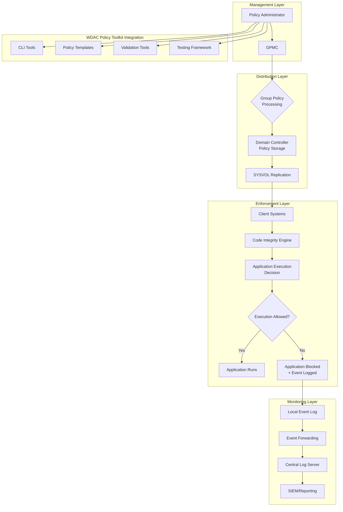
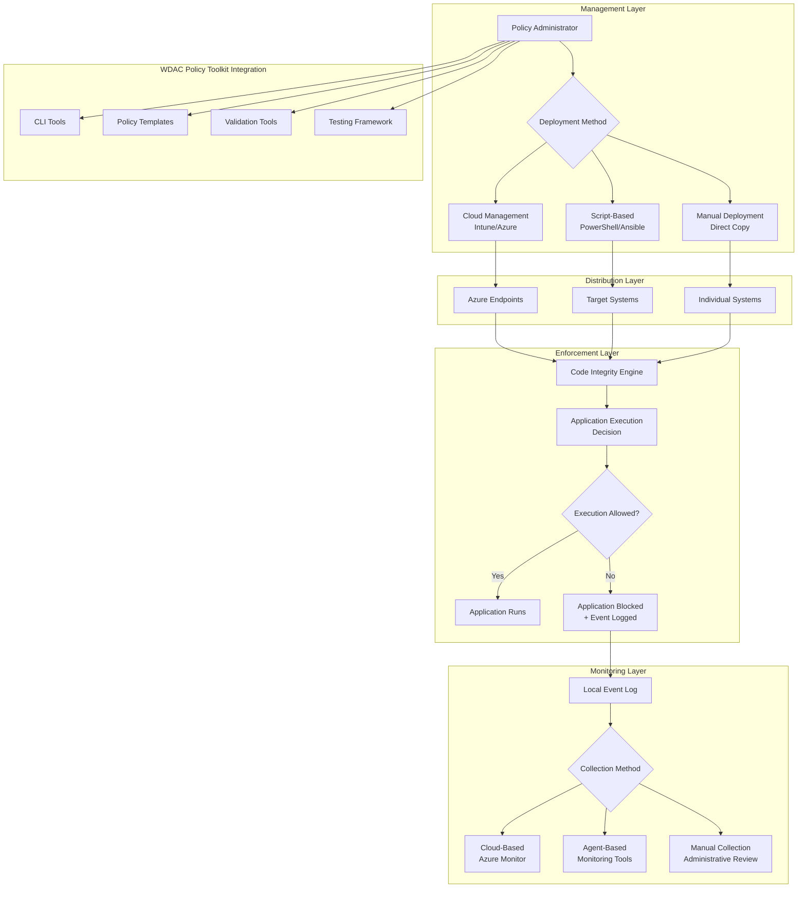
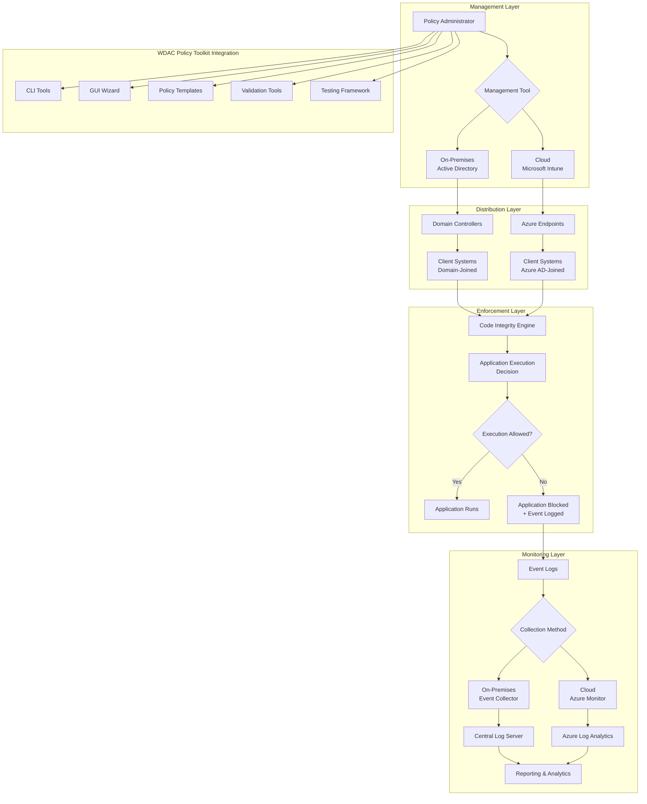

# WDAC Architecture for Active Directory and Non-AD Environments

This document provides detailed architectural guidance for implementing Windows Defender Application Control (WDAC) in both Active Directory and non-Active Directory environments, including deployment patterns, integration points, and management considerations with enhancements from the WDAC Policy Toolkit.

## Architecture Overview

Windows Defender Application Control operates at the kernel level to enforce application execution policies. The architecture differs significantly between Active Directory and non-AD environments, primarily in policy distribution, management, and monitoring approaches. The WDAC Policy Toolkit enhances these architectures with additional management capabilities.

## Active Directory Environment Architecture

### Core Components

#### 1. Policy Management Layer
- **Group Policy Objects (GPOs)**: Centralized policy definition and distribution
- **Group Policy Management Console**: Administrative interface for policy management
- **SYSVOL/DFS Replication**: Policy file distribution mechanism
- **Active Directory**: Policy storage and replication
- **WDAC Policy Toolkit**: Enhanced policy creation and management capabilities

#### 2. Policy Distribution Layer
- **Domain Controllers**: Host and replicate policy files
- **Client Systems**: Receive and apply policies through Group Policy
- **DNS**: Name resolution for domain services
- **Network Infrastructure**: Policy delivery network

#### 3. Enforcement Layer
- **Code Integrity Engine**: Kernel-level policy enforcement
- **Device Guard**: Hardware-based security features
- **Hypervisor-Protected Code Integrity (HVCI)**: Memory-based protection
- **Secure Boot**: Boot process integrity

#### 4. Monitoring and Reporting Layer
- **Event Logs**: Local policy execution logging
- **Event Forwarding**: Centralized log collection
- **SIEM Integration**: Security information and event management
- **Reporting Tools**: Compliance and audit reporting
- **WDAC Policy Toolkit**: Enhanced reporting and compliance capabilities

### Data Flow Architecture

### Integration Points

#### 1. Identity Integration
- **Active Directory Authentication**: User and computer authentication
- **Kerberos/NTLM**: Network authentication protocols
- **LDAP**: Directory service protocol
- **Certificate Services**: Policy signing infrastructure

#### 2. Security Integration
- **Microsoft Defender ATP**: Endpoint detection and response
- **Azure Security Center**: Cloud security management
- **SIEM Solutions**: Log aggregation and analysis
- **Configuration Management**: SCCM, Intune integration

#### 3. Infrastructure Integration
- **DNS/DHCP**: Network services
- **File Services**: Policy file hosting
- **Print Services**: Peripheral management
- **Remote Desktop**: Administrative access

## Non-AD Environment Architecture

### Core Components

#### 1. Policy Management Layer
- **Local Policy Files**: Individual system policy storage
- **Cloud Management**: Microsoft Intune, Configuration Manager
- **Script-Based Management**: PowerShell, Ansible, Puppet
- **Manual Administration**: Direct system management
- **WDAC Policy Toolkit**: Simplified policy creation and management

#### 2. Policy Distribution Layer
- **Cloud Services**: Azure, Intune endpoints
- **File Shares**: Network-based policy distribution
- **Direct Copy**: Manual policy placement
- **Script Execution**: Automated deployment mechanisms

#### 3. Enforcement Layer
- **Code Integrity Engine**: Kernel-level policy enforcement
- **Device Guard**: Hardware-based security features
- **HVCI**: Memory-based protection
- **Secure Boot**: Boot process integrity

#### 4. Monitoring and Reporting Layer
- **Local Event Logs**: System-specific logging
- **Cloud-Based Monitoring**: Intune reporting, Azure Monitor
- **Agent-Based Collection**: Third-party monitoring tools
- **Manual Reporting**: Periodic compliance checks
- **WDAC Policy Toolkit**: Enhanced reporting capabilities

### Data Flow Architecture

### Integration Points

#### 1. Cloud Integration
- **Azure AD**: Identity management
- **Microsoft Intune**: Mobile device management
- **Azure Monitor**: Log aggregation
- **Azure Security Center**: Security management

#### 2. Third-Party Integration
- **Configuration Management**: Ansible, Puppet, Chef
- **SIEM Solutions**: Splunk, QRadar, ArcSight
- **Monitoring Tools**: Nagios, Zabbix, SCOM
- **Automation Platforms**: Jenkins, Azure DevOps

#### 3. Local Infrastructure Integration
- **File Shares**: Policy distribution points
- **Print Services**: Peripheral management
- **Remote Desktop**: Administrative access
- **Backup Solutions**: Policy backup and recovery

## Hybrid Environment Architecture

### Core Components

#### 1. Dual Management Layer
- **On-Premises Management**: Active Directory, Configuration Manager
- **Cloud Management**: Azure AD, Microsoft Intune
- **Co-Management**: Integrated management approach
- **Policy Orchestration**: Coordination between management tools
- **WDAC Policy Toolkit**: Unified policy management capabilities

#### 2. Unified Distribution Layer
- **Hybrid Identity**: Azure AD Connect
- **Multi-Channel Distribution**: GPO + Cloud
- **Policy Conflict Resolution**: Precedence management
- **Consistent Enforcement**: Uniform policy application

#### 3. Enhanced Enforcement Layer
- **Unified Code Integrity**: Consistent enforcement
- **Cross-Platform Protection**: Windows 10/11, Server
- **Advanced Threat Protection**: Integrated security
- **Conditional Access**: Context-aware enforcement

#### 4. Comprehensive Monitoring Layer
- **Unified Logging**: Centralized event collection
- **Cross-Platform Monitoring**: Holistic visibility
- **Advanced Analytics**: Machine learning-based detection
- **Compliance Reporting**: Multi-environment reporting
- **WDAC Policy Toolkit**: Enhanced analytics and reporting

### Data Flow Architecture

## Policy Architecture Patterns

### 1. Tiered Policy Architecture

#### Base Policy
- Core security rules
- Microsoft and trusted vendor allowances
- Fundamental deny rules
- Platform-specific configurations

#### Supplemental Policies
- Department-specific rules
- Application exceptions
- Temporary allowances
- Environment-specific configurations

#### Exception Policies
- Emergency bypasses
- Temporary access grants
- Special case handling
- Break-glass procedures

### 2. Environment-Specific Architectures

#### Enterprise AD Environment
- Centralized policy management
- Hierarchical policy structure
- Automated deployment
- Integrated monitoring

#### Workgroup Environment
- Decentralized policy management
- Manual deployment processes
- Local monitoring
- Script-based automation

#### Cloud-Managed Environment
- Cloud-based policy management
- Automated deployment
- Cloud-native monitoring
- API-driven operations

## Security Architecture Considerations

### 1. Policy Integrity
- **Policy Signing**: Digital signatures for policy authenticity
- **Secure Boot**: Verified boot process
- **Trusted Platform Module**: Hardware-based security
- **Certificate Management**: PKI infrastructure

### 2. Access Control
- **Administrative Privileges**: Least privilege principles
- **Policy Modification Controls**: Change approval workflows
- **Audit Trails**: Comprehensive logging
- **Role-Based Access**: Segmented administrative access

### 3. Network Security
- **Encrypted Transmissions**: TLS for policy distribution
- **Network Segmentation**: Isolated management networks
- **Firewall Rules**: Controlled access policies
- **Intrusion Detection**: Network monitoring

## Scalability Architecture

### 1. Horizontal Scaling
- **Multiple Domain Controllers**: Distributed policy hosting
- **Load Balancing**: Even distribution of requests
- **Geographic Distribution**: Regional policy servers
- **Content Delivery Networks**: Global policy distribution

### 2. Vertical Scaling
- **Policy Optimization**: Efficient rule structures
- **Resource Allocation**: Adequate system resources
- **Performance Tuning**: Optimized configurations
- **Capacity Planning**: Future growth accommodation

## Disaster Recovery Architecture

### 1. Policy Backup
- **Version Control**: Git-based policy management
- **Regular Backups**: Automated backup processes
- **Offsite Storage**: Cloud-based backup storage
- **Recovery Testing**: Periodic restoration tests

### 2. Emergency Procedures
- **Safe Mode Access**: Boot-time policy bypass
- **Recovery Media**: Offline policy restoration
- **Emergency Contacts**: Escalation procedures
- **Documentation**: Recovery playbooks

## Monitoring and Analytics Architecture

### 1. Log Collection
- **Event Forwarding**: Centralized log collection
- **Cloud Integration**: Azure Monitor, AWS CloudWatch
- **SIEM Integration**: Enterprise security platforms
- **Custom Solutions**: Specialized monitoring tools

### 2. Analytics Processing
- **Real-Time Analysis**: Immediate threat detection
- **Batch Processing**: Comprehensive trend analysis
- **Machine Learning**: Anomaly detection
- **Behavioral Analysis**: Usage pattern recognition

### 3. Reporting Infrastructure
- **Dashboards**: Real-time status visualization
- **Scheduled Reports**: Regular compliance reporting
- **Ad-Hoc Queries**: Investigative reporting
- **Executive Summaries**: Strategic overview reports

## Best Practices for Architecture Implementation

### 1. Design Principles
- **Modularity**: Separable architectural components
- **Scalability**: Growth-capable designs
- **Resilience**: Fault-tolerant implementations
- **Security**: Defense-in-depth approaches

### 2. Implementation Guidelines
- **Phased Rollout**: Incremental deployment
- **Thorough Testing**: Comprehensive validation
- **Documentation**: Detailed architectural documentation
- **Training**: Staff education and certification

### 3. Maintenance Considerations
- **Regular Reviews**: Periodic architectural assessments
- **Performance Monitoring**: Ongoing optimization
- **Security Updates**: Continuous improvement
- **Compliance Audits**: Regular verification

This architectural guidance provides a comprehensive framework for implementing WDAC in various environments, ensuring security, scalability, and manageability across different organizational structures with enhancements from the WDAC Policy Toolkit.