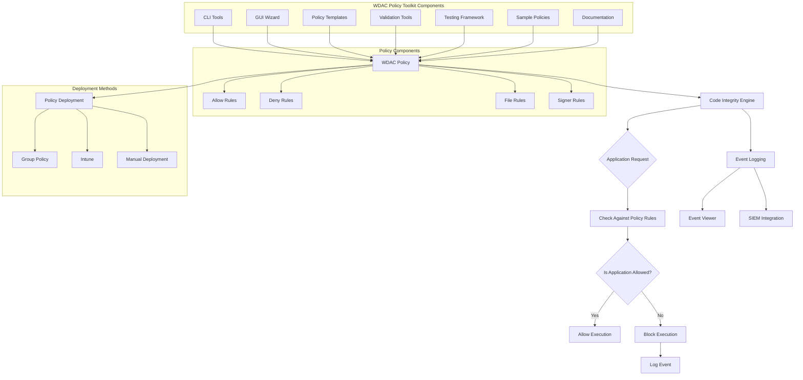

# WDAC Architecture Overview

This diagram shows the high-level architecture of Windows Defender Application Control (WDAC).

## Core Architecture Components

### 1. Policy Engine
The WDAC policy engine operates at the kernel level to enforce application execution policies. It evaluates each application execution request against the defined policy rules.

### 2. Policy Structure
WDAC policies are XML-based files that define what applications are allowed or denied. Policies contain:
- **Allow Rules**: Define what applications can run
- **Deny Rules**: Explicitly block specific applications
- **File Rules**: Path-based restrictions
- **Signer Rules**: Publisher certificate-based rules

### 3. Deployment Mechanisms
Policies can be deployed through multiple mechanisms:
- **Group Policy**: For Active Directory environments
- **Microsoft Intune**: For cloud-managed devices
- **Manual Deployment**: For standalone systems or testing

### 4. Monitoring and Logging
All WDAC decisions are logged for monitoring and compliance:
- **Event Viewer**: Local system event logs
- **SIEM Integration**: Centralized security information management
- **Audit Mode**: Non-blocking monitoring for policy testing

## WDAC Policy Toolkit Architecture

The WDAC Policy Toolkit enhances the core WDAC architecture with additional components:

### Command-Line Interface Tools
Powerful CLI tools for policy management:
- Policy generation from templates
- AppLocker to WDAC conversion
- Policy validation and simulation
- Deployment and rollback operations

### Graphical User Interface
Work-in-progress GUI wizard for simplified policy creation:
- Visual policy builder
- Template selection interface
- Rule configuration wizards
- Policy preview and validation

### Policy Management Components
- **Templates**: Pre-defined policy templates for common scenarios
- **Samples**: Real-world policy examples for reference
- **Validation Tools**: Syntax checking and policy simulation
- **Testing Framework**: Comprehensive test suites for validation

### Documentation and Guidance
Complete documentation suite including:
- Getting started guides
- Implementation tutorials
- Best practices recommendations
- Troubleshooting guidance