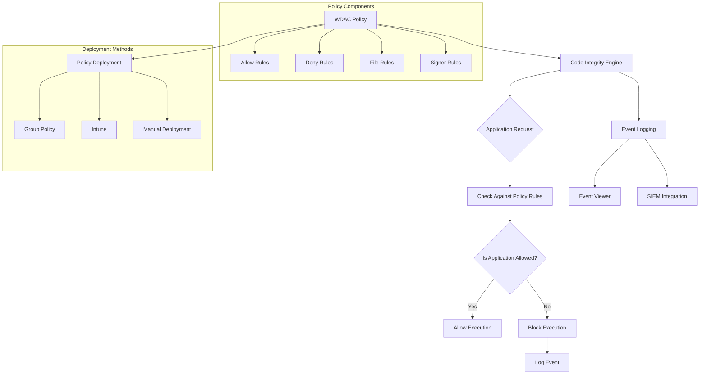

# WDAC Architecture Overview

This diagram shows the high-level architecture of Windows Defender Application Control (WDAC).

```mermaid
graph TB
    A[WDAC Policy] --> B[Code Integrity Engine]
    B --> C{Application Request}
    C --> D[Check Against Policy Rules]
    D --> E{Is Application Allowed?}
    E -->|Yes| F[Allow Execution]
    E -->|No| G[Block Execution]
    G --> H[Log Event]
    
    A --> I[Policy Deployment]
    I --> J[Group Policy]
    I --> K[Intune]
    I --> L[Manual Deployment]
    
    B --> M[Event Logging]
    M --> N[Event Viewer]
    M --> O[SIEM Integration]
    
    subgraph "Policy Components"
        A
        P[Allow Rules]
        Q[Deny Rules]
        R[File Rules]
        S[Signer Rules]
        A --> P
        A --> Q
        A --> R
        A --> S
    end
    
    subgraph "Deployment Methods"
        I
        J
        K
        L
    end
```