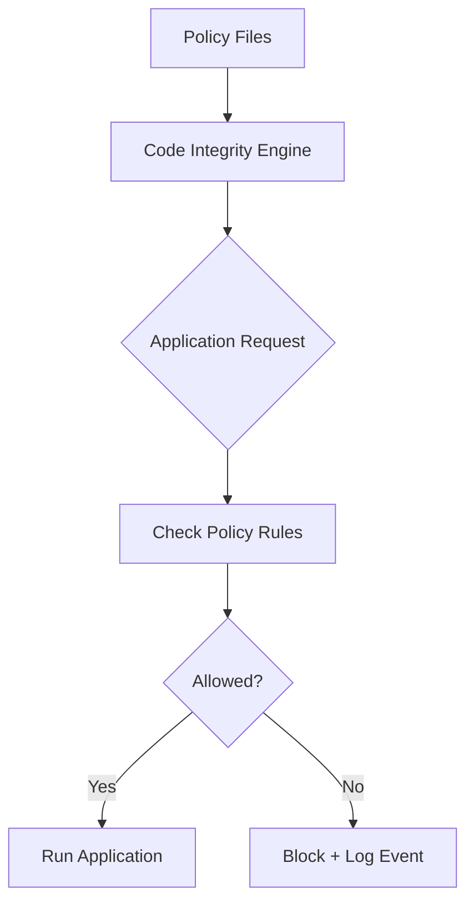

# WDAC Architecture - Simplified

## Core Components

### 1. Policy Files
- **Base Policy**: Core rules (Microsoft + trusted apps)
- **Supplemental Policies**: Department-specific rules
- **Deny Policies**: Block untrusted locations

### 2. Enforcement Engine
- **Code Integrity Engine**: Kernel-level application control
- **Device Guard**: Hardware-based protection
- **HVCI**: Memory protection

### 3. Deployment Methods
- **Active Directory**: Group Policy distribution
- **Non-AD**: Script-based or manual deployment
- **Cloud**: Intune/MDM management

## How It Works

## Environment Comparison

### Active Directory
- Centralized management via Group Policy
- Automatic policy distribution
- Integrated monitoring
- Best for: Enterprises with existing AD

### Non-AD (Workgroup)
- Manual or script-based deployment
- Local policy management
- Individual system monitoring
- Best for: Small offices, remote workers

## Key Benefits

✅ **Kernel-Level Protection**: Blocks unauthorized applications before execution
✅ **Hardware Security**: Uses Secure Boot and TPM
✅ **Flexible Deployment**: Works in any environment
✅ **Comprehensive Logging**: Detailed audit trails
✅ **Zero-Day Protection**: Blocks unknown malware

## Implementation Flow

1. **Plan**: Identify trusted applications
2. **Create**: Generate policy files
3. **Test**: Deploy in audit mode
4. **Deploy**: Switch to enforce mode
5. **Monitor**: Review blocked applications
6. **Maintain**: Update policies as needed