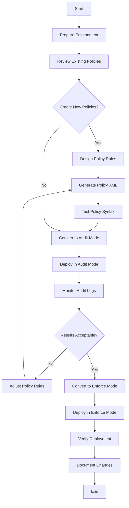

# WDAC Deployment Process

This diagram shows the step-by-step deployment process for WDAC policies.

```mermaid
flowchart TD
    A[Start] --> B[Prepare Environment]
    B --> C[Review Existing Policies]
    C --> D{Create New Policies?}
    D -->|Yes| E[Design Policy Rules]
    E --> F[Generate Policy XML]
    F --> G[Test Policy Syntax]
    G --> H[Convert to Audit Mode]
    H --> I[Deploy in Audit Mode]
    I --> J[Monitor Audit Logs]
    J --> K{Results Acceptable?}
    K -->|No| L[Adjust Policy Rules]
    L --> F
    K -->|Yes| M[Convert to Enforce Mode]
    M --> N[Deploy in Enforce Mode]
    N --> O[Verify Deployment]
    O --> P[Document Changes]
    P --> Q[End]
    
    D -->|No| H
```