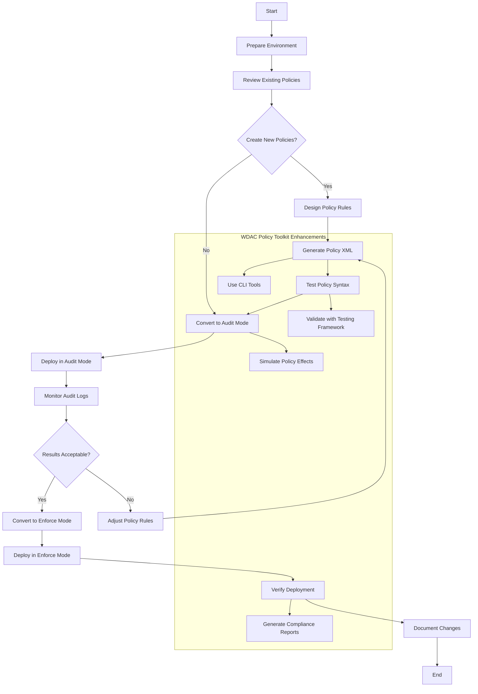

# WDAC Deployment Process

This diagram shows the step-by-step deployment process for WDAC policies using the WDAC Policy Toolkit.

## Enhanced Deployment Workflow

The WDAC Policy Toolkit provides enhanced deployment capabilities beyond the standard WDAC process:

### 1. Policy Generation
Using the `generate-policy-from-template.ps1` tool to create policies from pre-defined templates:
- Base policies for general system protection
- Supplemental policies for department-specific rules
- Deny policies for blocking known malicious applications
- Trusted app policies for explicit application allowances

### 2. Policy Validation
Before deployment, policies are validated using:
- XML syntax validation with `test-xml-validity.ps1`
- Policy simulation with `simulate-policy.ps1`
- Testing framework validation

### 3. Audit Mode Testing
Deploy policies in audit mode to identify legitimate applications that might be blocked:
- Use `convert_to_audit_mode.ps1` to prepare policies
- Monitor audit logs with analysis tools
- Generate compliance reports during audit phase

### 4. Enforce Mode Deployment
After successful audit testing:
- Convert policies to enforce mode with `convert_to_enforce_mode.ps1`
- Deploy using appropriate mechanism (Group Policy, Intune, manual)
- Verify deployment success

### 5. Ongoing Management
Post-deployment management capabilities:
- Policy merging with `merge_policies.ps1` for updates
- Rollback capabilities with `rollback_policy.ps1`
- Compliance reporting with `generate-compliance-report.ps1`
- Continuous monitoring and adjustment