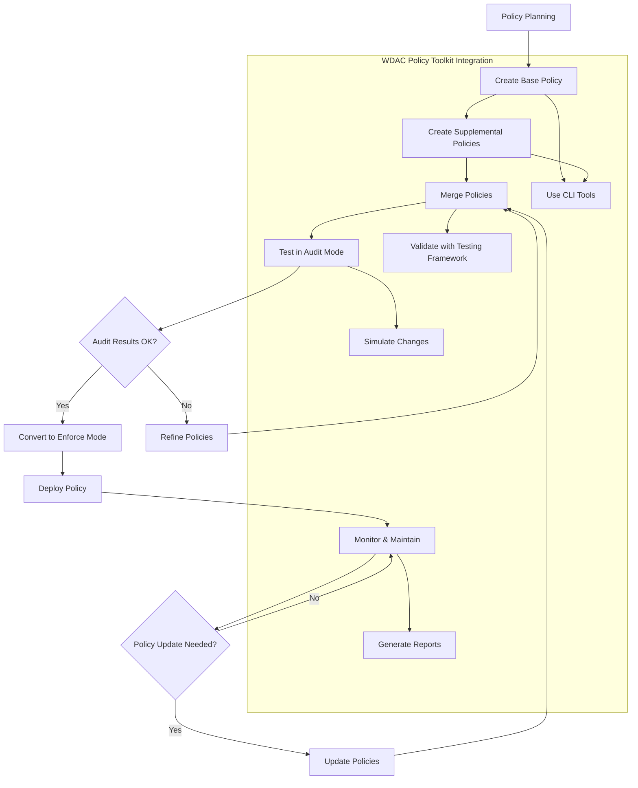

# WDAC Policy Lifecycle Flow

This diagram shows the typical lifecycle of a WDAC policy from creation to deployment and maintenance using the WDAC Policy Toolkit.

## Enhanced Policy Lifecycle

The WDAC Policy Toolkit enhances the standard policy lifecycle with additional capabilities:

### 1. Policy Planning Phase
- Utilize sample policies and templates for reference
- Leverage documentation and best practices guides
- Plan for environment-specific requirements

### 2. Policy Creation Phase
- Generate policies from templates using CLI tools
- Customize policies with environment-specific rules
- Apply industry-specific policy patterns

### 3. Policy Merging Phase
- Combine base and supplemental policies
- Resolve policy conflicts and overlaps
- Validate merged policy integrity

### 4. Testing Phase
- Deploy in audit mode for non-blocking testing
- Monitor audit logs for blocked legitimate applications
- Use simulation tools to predict policy effects
- Validate with comprehensive testing framework

### 5. Deployment Phase
- Convert to enforce mode for active protection
- Deploy using appropriate mechanisms
- Verify successful deployment

### 6. Monitoring and Maintenance Phase
- Continuous monitoring of policy effectiveness
- Generate compliance and audit reports
- Update policies as needed based on changing requirements
- Maintain policy documentation and version history

### 7. Policy Evolution
- Refine policies based on real-world usage
- Incorporate new threat intelligence
- Adapt to changing business requirements
- Optimize for performance and usability