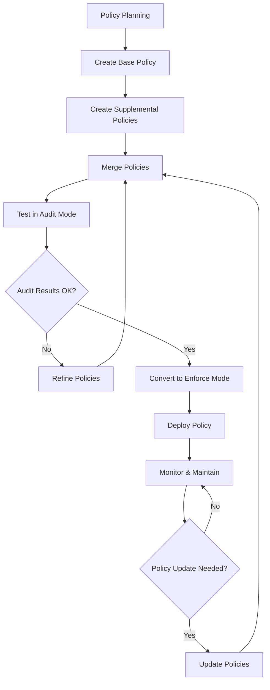

# WDAC Policy Lifecycle Flow

This diagram shows the typical lifecycle of a WDAC policy from creation to deployment and maintenance.

```mermaid
flowchart TD
    A[Policy Planning] --> B[Create Base Policy]
    B --> C[Create Supplemental Policies]
    C --> D[Merge Policies]
    D --> E[Test in Audit Mode]
    E --> F{Audit Results OK?}
    F -->|No| G[Refine Policies]
    G --> D
    F -->|Yes| H[Convert to Enforce Mode]
    H --> I[Deploy Policy]
    I --> J[Monitor & Maintain]
    J --> K{Policy Update Needed?}
    K -->|Yes| L[Update Policies]
    L --> D
    K -->|No| J
```